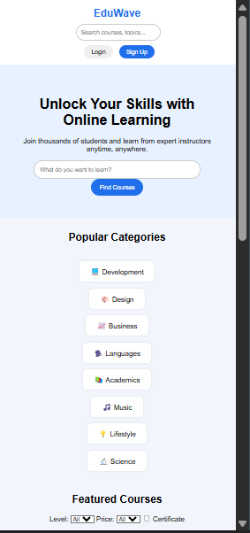
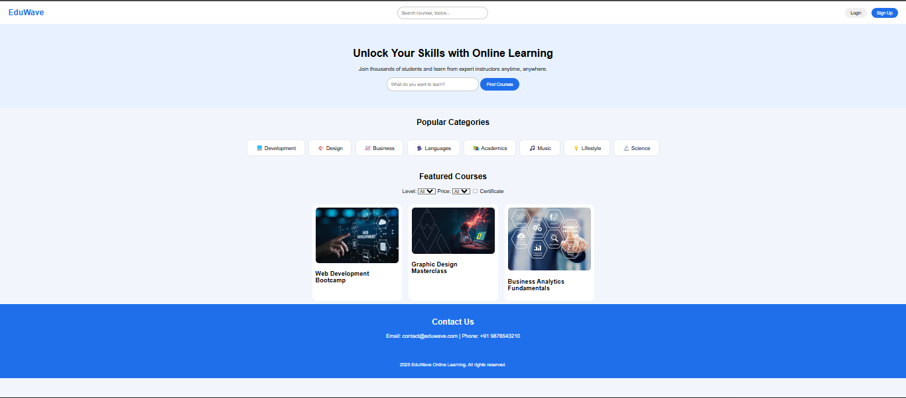
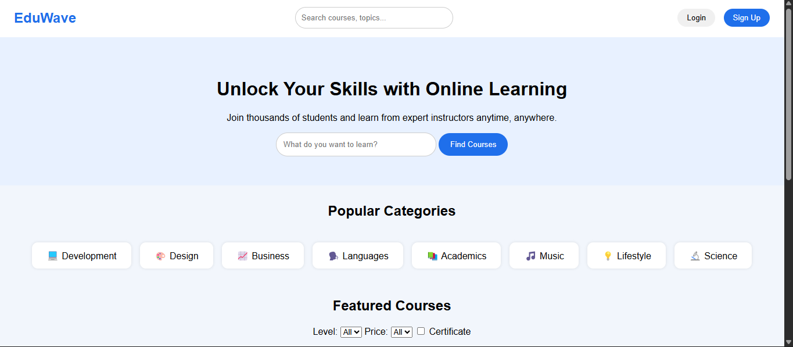

# EduWave - Online Learning Platform

# Project Theme

Online Learning Website

# Description

EduWave is a website for students to learn online courses easily. The main sections in the website are:

- Header & Navbar: Logo, search bar, login and signup buttons
- Hero Section: Introduction with a search bar to find courses
- Popular Categories: Different course categories with icons like Development, Design, Business, Languages, Music, etc.
- Featured Courses: Cards showing courses with images and titles
- Contact Section: Contact information like email and phone number
- Footer: Website copyright info

# Layout & Responsiveness

- Techniques Used: Flexbox and CSS Grid
- Working in
  - Mobile
  - Tablet
  - Desktop

The website works on all screen sizes. On smaller screens, categories and courses stack vertically for easy viewing.

# How to Open Locally

1. Download or copy the project folder.
2. Open `cap.html` in any browser.
3. Keep `cap.css` and images in the same folder.

(I minimized screen size (50%) to capture screenshot of maximum viw of website. As per screen size (100% or 50%) it is responsive.)

orignal view 
